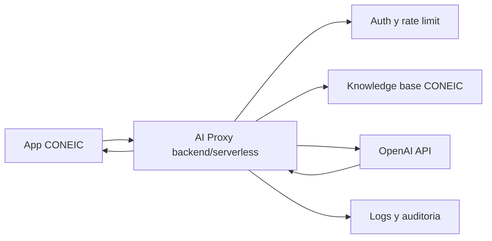

# Guia para activar IA real en CONEIC Assistant

## Decision actual

La app usa `EXPO_PUBLIC_ASSISTANT_MODE=demo`. Esto mantiene el asistente funcional sin backend y evita exponer credenciales en GitHub Pages.

No se debe llamar a OpenAI directo desde la app web/mobile porque cualquier key incluida en el frontend queda publica. En GitHub Pages el codigo estatico puede inspeccionarse desde el navegador.

## Arquitectura recomendada



## Flujo

1. La app envia mensaje, `eventId`, `participantCode` y contexto permitido al proxy.
2. El proxy valida sesion, limita frecuencia y limpia datos sensibles.
3. El proxy recupera contexto curado: agenda, sedes, pagos, certificados, visitas y soporte.
4. El proxy llama a OpenAI con instrucciones del evento y fuentes permitidas.
5. El proxy devuelve respuesta, intencion, confianza, fuente y acciones sugeridas.
6. La app renderiza la respuesta y navega con quick actions.

## Contrato sugerido

`POST /api/assistant/chat`

Request:

```json
{
  "eventId": "coneic-cusco-2026",
  "participantCode": "CNE-2026-00001",
  "message": "Como pago mi inscripcion?",
  "screen": "Assistant"
}
```

Response:

```json
{
  "text": "Puedes pagar desde la pasarela oficial...",
  "intent": "payments",
  "confidence": 0.91,
  "sourceLabel": "Base oficial CONEIC Cusco 2026",
  "actions": [
    { "label": "Ver credencial", "route": "ProfileTab" },
    { "label": "Soporte", "route": "Settings" }
  ]
}
```

## Guardrails minimos

- No inventar fechas, precios, sedes ni cupos.
- Responder solo con fuentes curadas del comite.
- Derivar a soporte humano cuando falte informacion.
- Ocultar DNI, telefonos y datos sensibles.
- Registrar preguntas frecuentes para mejorar onboarding y soporte.
- Rate limit por usuario/IP.

## Variables

```bash
EXPO_PUBLIC_ASSISTANT_MODE=demo
EXPO_PUBLIC_AI_PROXY_URL=https://api.coneic.example.com/api/assistant/chat
EXPO_PUBLIC_EVENT_ID=coneic-cusco-2026
```

## Siguiente iteracion

El primer backend real puede ser una funcion serverless que lea una base JSON versionada de CONEIC y llame al modelo desde servidor. La app no requiere cambios grandes: `assistantService` debe cambiar de mock local a `fetch(EXPO_PUBLIC_AI_PROXY_URL)`.
